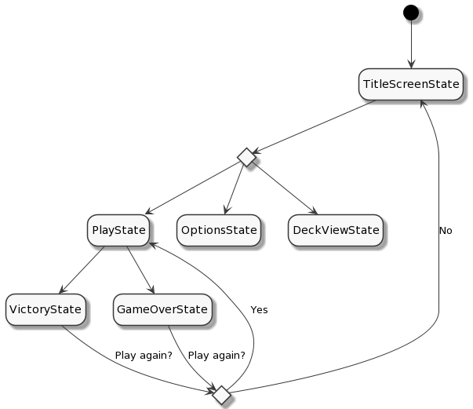
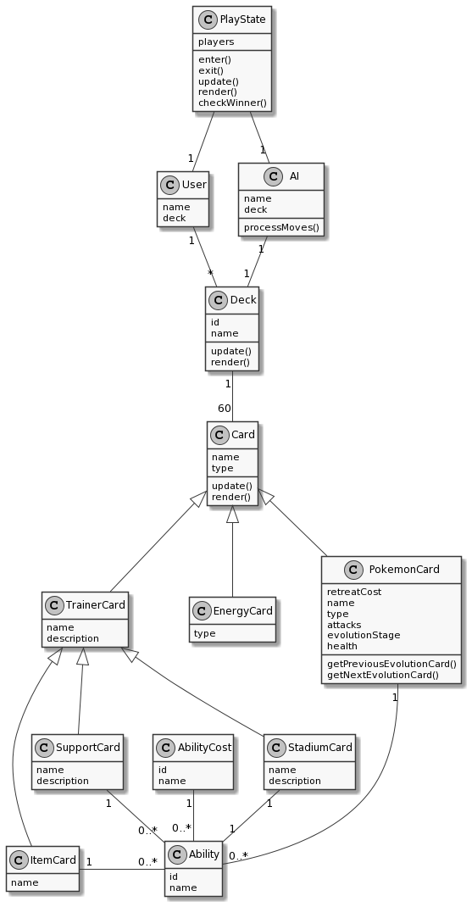
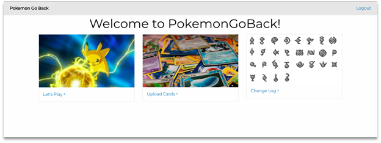
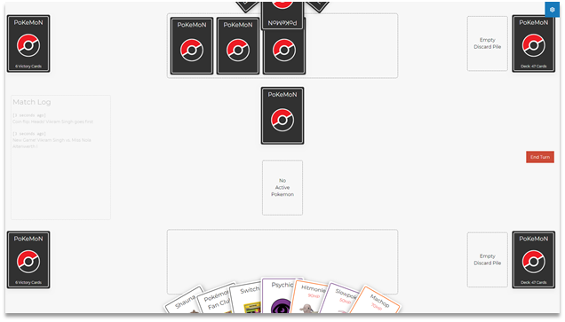

# Game Programming Project - Pokémon the Trading Card Game

> [!note]
> This was taken from a project I did in university so the scope is **much** larger than what I'm expecting from you in terms of number of features!

## ✒️ Description

In this turn-based battle card game, players assume the role of a Pokémon trainer and use their Pokémon to battle their opponent's Pokémon. Players play Pokémon to the field and attack their opponent's Pokémon. A Pokémon that has sustained enough damage is Knocked Out, and the player who knocked it out draws a Prize card. There are usually six Prize cards, and the primary win condition is to draw all of them. Other ways to win are by knocking out all the Pokémon the opponent has on the field so that the opponent has none left, or if at the beginning of their opponent's turn there are no cards left to draw in the opponent's deck.

## 🕹️ Gameplay

Players begin by having one player select heads or tails, and the other flips a coin; the winner of the coin flip will decide who goes first or second. The player going first cannot attack their first turn, unless the card says otherwise. (Dice may be used in place of coins, with even numbers representing heads and odd numbers representing tails). Players then shuffle their decks and draw seven cards, then play one Basic Pokémon onto the field. This Pokémon is known as the Active Pokémon and is usually the one that attacks and receives damage. If a player does not have any Basic Pokémon, they must shuffle and draw a new hand, and the opponent may draw one additional card. Once both players have at least one Basic Pokémon, they can play up to five more Basic Pokémon onto their "Bench" (representing the maximum-carry limit of six from the video games). Players then take the top six cards of their deck and place them to the side as Prize Cards. Play then begins with the player who won the coin flip.

Play alternates between players who may take several actions during their turn, including playing new Basic Pokémon, evolving their Pokémon, playing Trainer cards and Energy cards, and using Pokémon Abilities. A player may also retreat their Active Pokémon, switching the Active Pokémon with one on the Bench. At the end of their turn, a player may use one of their Active Pokémon's attacks, provided the prerequisite amount and types of Energy are attached to that Pokémon. Effects from that attack are then activated and damage may be placed on the Defending Pokémon; some attacks simply have effects but do not do damage. Damage may be modified depending on whether the defender has a weakness or a resistance to the attacker's Pokémon type. If the final damage exceeds the defending Pokémon's HP, it is Knocked Out, and the active player takes a prize card and ends their turn.

This implementation of _Pokémon the Trading Card Game_ is a single player experience with an AI. The game is played primarily with the mouse to interact with the cards and general GUI. The players can optionally hit `M` on their keyboard to mute all game sounds.

## 📃 Requirements

> [!note]
> This was a web project so that's why you'll see requirements about logging in and uploading data which for you is irrelevant. Focus more on the requirements describing actions taken for gameplay.

1. The user shall register to be able to login.
2. The user shall login to be able to play a game.
3. The user shall upload a valid deck file.
4. The user shall upload a valid cards file.
5. The user shall upload a valid abilities file.
6. The user shall select which deck they will use in the game.
7. The user shall select which deck the AI will use in the game.
8. The system shall "flip a coin" to decide which player goes first.
9. The system shall shuffle the user's deck.
10. The system shall draw the top 7 cards from the user's deck.
11. If the user does not have a Basic Pokémon in their hand the system shall "mulligan" until they do.
12. Upon each mulligan, the AI shall draw a card.
13. The user shall put one of their Basic Pokémon face down as their Active Pokémon.
14. The user shall put up to 5 more Basic Pokémon face down on their Bench.
15. Upon a new turn, the system shall draw a card from the deck of the current player.
16. Upon a new turn, the system shall place the drawn card in the hand of the current player.
17. The user shall put (up to 5 total) Basic Pokémon cards from their hand onto their Bench.
18. The user shall Evolve their Pokémon as many times as they choose.
19. The user shall attach an Energy card from their hand to one of their Pokémon once per turn.
20. The user shall play Trainer cards (as many as they want, but only one Supporter card and one Stadium card per turn).
21. The user shall Retreat their Active Pokémon once per turn.
22. The user shall use as many Abilities as they choose.
23. The user shall attack the opponent's Active Pokémon.
24. After a player attacks, the system shall end their turn and start their opponent's turn.
25. The system shall execute any "special conditions" after a turn is over.
26. The user shall pick a Victory Card when the opposing Active Pokémon dies.

### 🤖 State Diagram

> [!note]
> Remember that you'll need diagrams for not only game states but entity states as well.

### 🗺️ Class Diagram

### 🧵 Wireframes

> [!note]
> Your wireframes don't have to be super polished. They can even be black and white. I'm just looking for a rough idea about what you're visualizing.

- _Let's Play_ will navigate to the main game.
- _Upload Cards_ will navigation to the forms for uploading and parsing the data files for the game.
- _Change Log_ will navigate the user to a page with a list of features/changes that have been implemented throughout the development of the game.

We want to keep the GUI as simple and clear as possible by having cards with relevant images to act as a way for the user to intuitively navigate the game. We want to implement a layout that would look like as if one were playing a match of the Pokémon Trading Card Game with physical cards in real life. Clicking on any of the cards will reveal that card's details to the player.

### 🎨 Assets

We used [app.diagrams.net](https://app.diagrams.net/) to create the wireframes. Wireframes are the equivalent to the skeleton of a web app since they are used to describe the functionality of the product and the users experience.

We plan on following trends already found in other trading card video games, such as Pokémon Trading Card Game Online, Hearthstone, Magic the Gathering Arena, and Gwent.

The GUI will be kept simple and playful, as to make sure the game is easy to understand what each component does and is, as well as light hearted to keep to the Pokémon theme.

#### 🖼️ Images

- Most images will be used from the well known community driven wikipedia site, [Bulbapedia](https://bulbapedia.bulbagarden.net/wiki/Main_Page).
- Especially their [Trading Card Game section](https://bulbapedia.bulbagarden.net/wiki/Full_Art_card_(TCG)).

#### ✏️ Fonts

For fonts, a simple sans-serif like Roboto will look quite nice. It's a font that is legible, light on storage size, and fun to keep with the theme we're going for. We also used a more cartoonish Pokemon font for the title screen.

- [Pokemon](https://www.dafont.com/pokemon.font)
- [Roboto](https://fonts.google.com/specimen/Roboto)

#### 🔊 Sounds

All sounds were taken from [freesound.org](https://freesound.org) for the actions pertaining to cards.

- [Shuffle cards](https://freesound.org/people/VKProduktion/sounds/217502/)
- [Flip card](https://freesound.org/people/Splashdust/sounds/84322/)

### 📚 References

- [Pokemon Rulebook](http://assets.pokemon.com/assets/cms2/pdf/trading-card-game/rulebook/xy8-rulebook-en.pdf)
